# Linux tray icon experiments

Throwaway branch `claude/optimistic-gauss-up1560`. One PyInstaller build contains every
experiment, selected by CLI flags (`app/desktop/tray_experiments.py`,
`app/desktop/tray_sni.py`). Default behavior with no flags is unchanged.

**TL;DR**

- The black box is **not** a resize problem. pystray's `xorg` (XEmbed) backend pastes
  the RGBA icon onto a black RGB canvas with no mask, so **alpha is thrown away**.
  Every transparent pixel becomes black.
- The frozen build always ends up on `xorg` because **it has no PyGObject (`gi`)**.
  pystray's `appindicator` and `gtk` backends fail with `No module named 'gi'`, and pystray
  hides that error. Your hypothesis 2(a) is right; 2(b) is wrong: the PNG is a clean RGBA.
- Hypothesis 1 is **wrong for Pillow**. `Image.resize()` already premultiplies RGBA.
  The jaggies come from LANCZOS ringing: it leaves 74 pixels with alpha 1–15 whose RGB is
  pure white. Once the xorg backend drops alpha, those show up as white dashes and fill the gap in the K.
- There is also an **asset problem**. Linux ships `mac_taskbar.png`, a pure-white *template*
  glyph that macOS recolors. Even with working alpha it is near-invisible on light panels.
- Just bundling `gi` **does not fix it**. Kiln uses `run_detached()` and a Tk
  mainloop, and nothing iterates GLib, so the AppIndicator never registers and **no
  icon appears at all**. A GLib main-loop thread is required.
- **Recommendation: a small pure-Python StatusNotifierItem (D-Bus) tray** (prototype in
  `tray_sni.py`, ~350 lines, one pure-Python dependency `jeepney`), with the vector-rendered
  `color` icon (or `symbolic` + pixmap fallback). It works on GNOME, XFCE and KDE, has
  real alpha, multiple sizes and a working menu, needs no GTK in the bundle, and is
  Wayland-native. Details and tradeoffs below.

## 1. Diagnosis (ground truth)

### Where the icon comes from

- `app/desktop/desktop.py` `run_tray()` opens `resource_path("taskbar.png")` and passes it to
  `KilnTray` (`custom_tray.py`), a subclass of `pystray.Icon`. pystray picks its backend at
  import time.
- `build_desktop_app.sh` copies **`mac_taskbar.png`** to `taskbar.png` for macOS **and Linux**.
  Windows gets `win_taskbar.png`. `app/desktop/taskbar.png` in the repo is byte-identical to
  `mac_taskbar.png`.

### The PNG itself (measured with Pillow)

| file | mode | size | alpha | RGB under alpha=0 | opaque colors |
|---|---|---|---|---|---|
| `taskbar.png` = `mac_taskbar.png` | RGBA | 88×88 | 6240 transparent, 214 partial, 1290 opaque | all `(0,0,0)` | 1 color: pure white |
| `win_taskbar.png` | RGBA | 88×88 | 3915 / 456 / 3373 | all black | 3 brand colors |
| `app/web_ui/static/logo.svg` | vector | 912 viewBox | – | – | `#E74D31` rect, `#415CF5`/`#F4B544` triangles |

So the PNG is a clean straight-alpha RGBA, and hypothesis 2(b) is wrong. The macOS glyph is
**white** because macOS treats it as a template (`setTemplate_(True)` in `custom_tray.py`)
and recolors it. No Linux path recolors it.

`logo.svg` is the best source: three simple filled shapes that the generator parses directly.

### Which backend actually loads (logged by `tray_experiments.py`)

| run | gi | pystray backend | why |
|---|---|---|---|
| `python desktop.py` (repo venv as-is) | `ModuleNotFoundError: No module named 'gi'` | **xorg** | appindicator/gtk import fails; pystray swallows it |
| current production-style frozen build (`dist-nogi`) | not bundled | **xorg** | same |
| frozen build with gi bundled (`dist-gi`) | OK, from `_MEIPASS` | **appindicator** (Ayatana) | `GI_TYPELIB_PATH=_MEIPASS/gi_typelibs` set by PyInstaller's runtime hook |

Session inputs logged in both VMs: `XDG_SESSION_TYPE=x11`, `XDG_CURRENT_DESKTOP=GNOME` / `XFCE`,
`org.kde.StatusNotifierWatcher` present and `IsStatusNotifierHostRegistered=true` on both, and an
XEmbed tray manager on both. GNOME's legacy tray advertises a 24-bit visual; XFCE's advertises
a 32-bit ARGB visual.

Note: pystray's backend chooser only catches `ImportError`. If `gi` imports but no
AppIndicator typelib exists, `gi.require_version` raises `ValueError`, `import pystray` fails,
`KilnTray` falls back to `object`, and `KilnTray("kiln", …)` raises `TypeError` **outside** the
`try` in `run_tray`, which crashes app startup. The current build is safe only because it has no gi.

### Why it's a black box, and why it's jaggy

pystray 0.19.5 `_xorg.Icon._assert_icon_data`:

```python
self._icon_data = PIL.Image.new('RGB', (width, height))          # black
self._icon_data.paste(self._icon.resize((width, height), LANCZOS))  # no mask -> alpha dropped
```

The window is also created with the root depth (24-bit), so the xorg backend can never show
per-pixel alpha. Every transparent pixel becomes black, which is the box.

The jaggies come from the resize and the dropped alpha together, not from a straight-alpha
resize. Pillow's `Image.resize()` converts RGBA to premultiplied `RGBa` internally (the
`RGBa` conversion is in `Image.resize`), so edge pixels keep RGB 255. But LANCZOS rings, and at
22px it leaves 74 pixels with alpha 1–15, all with RGB `(255,255,255)`, around the glyph and inside the gap
of the K. When pystray drops alpha, those faint pixels become solid white: the dashed outline and
the filled-in K in the screenshot. The contact sheet row "baseline via xorg (alpha dropped)"
reproduces the panel pixel for pixel.

PR #1814 composites onto `#44463c` before resizing, so the resize is clean, but the result is
an opaque dark square. That's exactly the "solid black background on a light bar" you saw.

### Two more blockers found on the way

1. **Kiln never runs a GLib main loop.** `run_tray()` calls `run_detached()` and then the Tk
   mainloop. pystray's GTK backends route every call through `GObject.idle_add`, so with gi
   present **the AppIndicator is never registered and no icon appears at all**
   (`gi-default-noglib` rows below). `tray_experiments.after_run_detached()` starts a daemon
   thread running `GLib.MainLoop().run()`; `--tray-glib-thread off` reproduces the bug.
2. **The xorg backend has no menu** (`HAS_MENU = False`) and Kiln sets no default item on Linux,
   so clicks do nothing today. Quit is unreachable from the tray.

## 2. Assets (`scripts/gen_tray_icons.py`)

- Parses `logo.svg` (M/L/H/V/C/Z paths plus a rounded rect) and fills the shapes at 16× supersampling,
  then box-averages down. That is area-coverage anti-aliasing computed on premultiplied values,
  so fringes can't happen, and nothing is resized after rendering.
- Simple hinting: the rect's left and right edges, the triangles' left edge and the glyph's right edge
  are snapped to whole pixels at every size, so stems stay crisp at 16–24px.
- The glyph is trimmed to its bounding box and fills the canvas height. `-edge` variants inset by 1px so the
  outline (a 3×3 dilation at 45% alpha) isn't clipped.
- Sets (sizes 16, 22, 24, 32, 48, 64, in `app/desktop/tray_icons/`): `color`, `tile` (brand
  blue `#415CF5`, 22% corner radius, white knock-out), `mono-white`, `mono-black`,
  `mono-white-edge`, `mono-black-edge`, `pr1814` (the PR's exact code), `themed/hicolor/…`
  (the `color` set as an icon theme, so the host can pick a size), and `symbolic/kiln-symbolic.svg`.

### Contact sheet

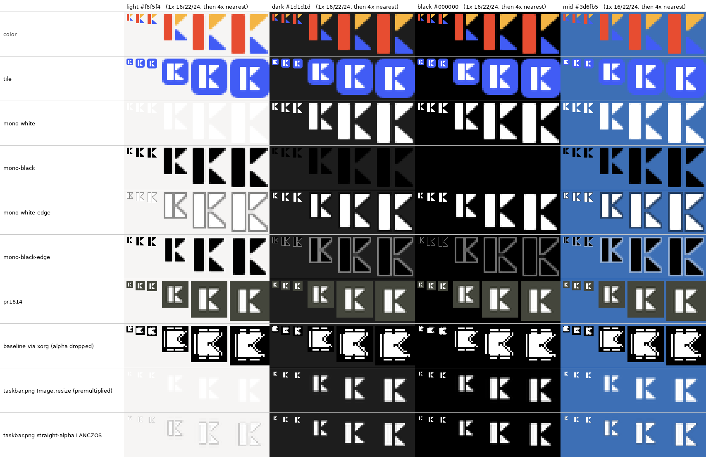

Every set at 16/22/24px at 1×, then 4× nearest neighbour, on light `#f6f5f4`, dark `#1d1d1d`, black and
mid `#3d6fb5`. The last three rows are comparisons only:

- *baseline via xorg (alpha dropped)*: what users see today.
- *taskbar.png Image.resize*: Pillow's default, already premultiplied, so no halo. It's white on white on light panels.
- *taskbar.png straight-alpha LANCZOS*: a true per-channel straight-alpha resize, which does show
  the dark halo from your hypothesis. Pillow just doesn't do this by default.

What I checked on the sheet:

- There are no halos on any generated set.
- `color`: the blue triangle has low contrast on the mid-blue panel (brand color versus panel
  color), and it's only fair on pure black. Everything else is legible at 16px.
- `mono-*`: crisp at 16px. `mono-white` disappears on light and `mono-black` on dark, which is the
  reason for `mono-auto` and `-edge`.
- `-edge`: the outline keeps the glyph visible on any background, but it looks outlined, like a
  sticker, on the matching background.
- `tile`: reads well everywhere. At 16px the glyph is about 10px tall and still recognisable.

### `kiln-symbolic.svg`: one file for GNOME and KDE

```xml
<svg … width="16" height="16" viewBox="<square around glyph>">
  <style type="text/css" id="current-color-scheme">.ColorScheme-Text { color:#232629; }</style>
  <rect … class="ColorScheme-Text" style="fill:currentColor"/>
  <path … class="ColorScheme-Text" style="fill:currentColor"/> ×2
</svg>
```

- **GNOME/GTK:** any icon named `*-symbolic` is loaded through a wrapper that forces `fill` on
  `rect`/`path` to the foreground color, so the fills are overridden regardless.
- **KDE:** KIconLoader replaces the contents of `<style id="current-color-scheme">` with the
  current color scheme, and `fill:currentColor` on elements with class `ColorScheme-Text` follows it.
- The file is served unthemed from its own directory via `IconThemePath` plus the name `kiln-symbolic`.

Verified recoloring: on GNOME it drew white, like the system power icon. On XFCE it drew `#2e3436` on the light panel and
`#eeeeec` on the dark one, while the SVG's own default color is `#232629`. KDE is not verified (see §6).


## 3. Results in the VM

Everything below is the **real frozen binary** (`app/desktop/build/dist-{nogi,gi}/Kiln`, onefile,
built on the same GitHub Actions CPython 3.13 that CI uses), running on real panels under Xvfb. Crops are
3× nearest neighbour. KDE was done with the unfrozen app only (see §6).

- `dist-nogi` is today's production build plus the experiment code and assets, **without** PyGObject.
  pystray always loads `xorg` here.
- `dist-gi` bundles PyGObject, GTK 3 and AyatanaAppIndicator3. pystray loads `appindicator` by default.

Production today, the black box, reproduced on XFCE light (full panel, then 4×):


The recommended SNI tray with the `color` icon, same panel:


### Results table

"Alpha" means real per-pixel transparency was observed, with no box. Legibility is my read of the crop.
Log facts (backend, argb, mono-auto decision, glib thread) come from each run's
`[tray]` log.

| variant / flags | build → backend (logged) | GNOME 46 (dark, fixed) | XFCE light | XFCE dark | KDE 5.27 light / dark (unfrozen) |
|---|---|---|---|---|---|
| *(no flags)* = production | nogi → xorg | ❌ jaggy white block, box invisible on black | ❌ **white jaggy K in black box** | ❌ black box | ❌ not shown by xembedsniproxy in VM |
| `pr1814` | nogi → xorg | ⚠️ opaque dark tile | ❌ dark square | ⚠️ grey-green square | – |
| `color` | nogi → xorg | ⚠️ looks OK only because panel is black | ❌ black fill + ringing artefacts | ❌ | – |
| `color --tray-xorg argb` | nogi → xorg, `argb=True` on XFCE / `False` on GNOME (24-bit tray visual) | ⚠️ opaque, invisible on black | ✅ alpha | ✅ alpha | – |
| `mono-auto --tray-xorg argb` | nogi → xorg | ✅ white (panel is black) | ✅ black | ✅ white | – |
| `color --tray-xorg bg:auto` | nogi → xorg | ⚠️ faint `#1d1d1d` box on the black bar | ✅ `#f6f5f4` matches the panel | ✅ close match | – |
| `--tray-backend sni` (baseline png) | nogi → **sni** | ✅ alpha, tiny white glyph | ❌ white on light (asset problem) | ✅ | – |
| `--tray-backend sni --tray-variant color` | nogi → **sni** | ✅ alpha, multi-size | ✅ | ✅ | ✅ / ✅ |
| `sni` + `tile` | nogi → sni | ✅ | ✅ | ✅ | – |
| `sni` + `mono-auto` | nogi → sni | ✅ white | ✅ black | ✅ white | ✅ black / ✅ white |
| `sni` + `mono-white-edge` / `mono-black-edge` | nogi → sni | ✅ / ⚠️ black glyph, grey outline | ⚠️ white glyph, grey outline / ✅ | ✅ / ⚠️ | – |
| `sni` + `symbolic` | nogi → sni (IconName + IconThemePath) | ✅ **recolored white** | ✅ **recolored `#2e3436`** | ✅ **recolored `#eeeeec`** | ✅ recolored dark / ✅ recolored white |
| *(no flags)*, `--tray-glib-thread off` | gi → appindicator | ❌ **no icon at all** | ❌ **no icon** | ❌ **no icon** | – |
| *(no flags)* | gi → appindicator + GLib thread | ✅ alpha, small white glyph | ❌ white on light | ✅ | – |
| `pr1814` | gi → appindicator | ⚠️ opaque tile | ❌ dark square | ⚠️ | – |
| `color` (64px PNG) / `color --tray-size 22` | gi → appindicator | ⚠️ alpha, but dark fringe on red stem (GNOME rescales the PNG) | ✅ | ✅ | ✅ / – |
| `themed` (hicolor sizes via IconThemePath) | gi → appindicator | ✅ no fringe | ✅ | ✅ | – |
| `tile` | gi → appindicator | ✅ | ✅ | ✅ | – |
| `mono-auto` | gi → appindicator | ✅ white | ✅ black | ✅ white | – |
| `symbolic` (`ThemedTray` subclass) | gi → appindicator | ✅ recolored | ✅ recolored | ✅ recolored | ✅ / ✅ recolored |
| `--tray-backend gtk --tray-variant color` | gi → gtk (GtkStatusIcon/XEmbed) | ✅ alpha | ✅ | ✅ | – |
| `--tray-backend xorg` | gi → xorg | ❌ same as production | ❌ | ❌ | – |

Grids (every cell above, plus labels):

| | without gi (`dist-nogi`) | with gi (`dist-gi`) |
|---|---|---|
| GNOME dark | 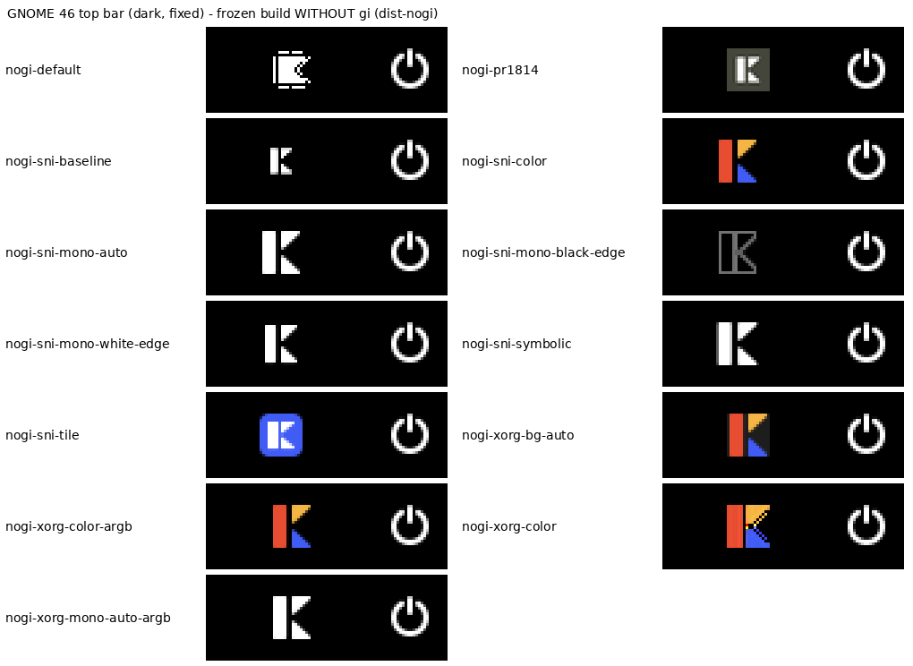 | 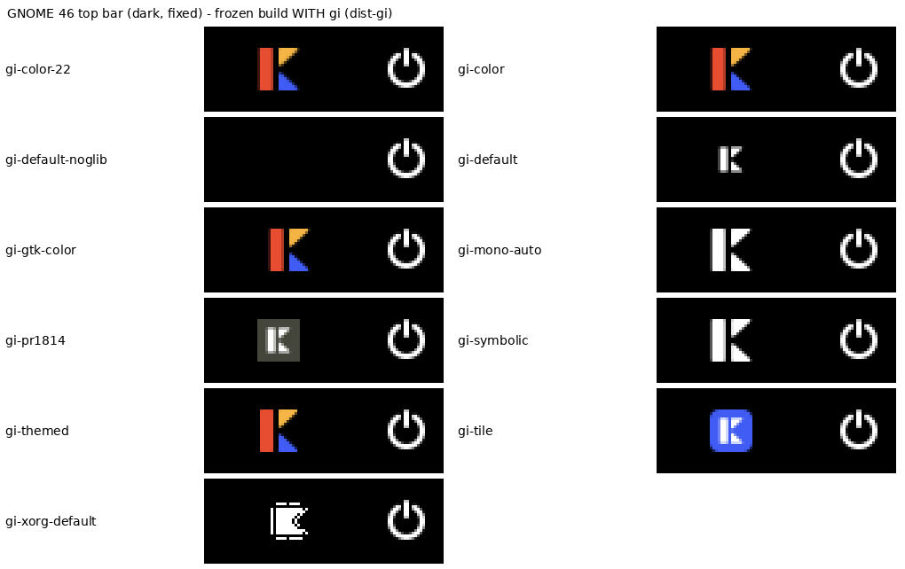 |
| XFCE light | 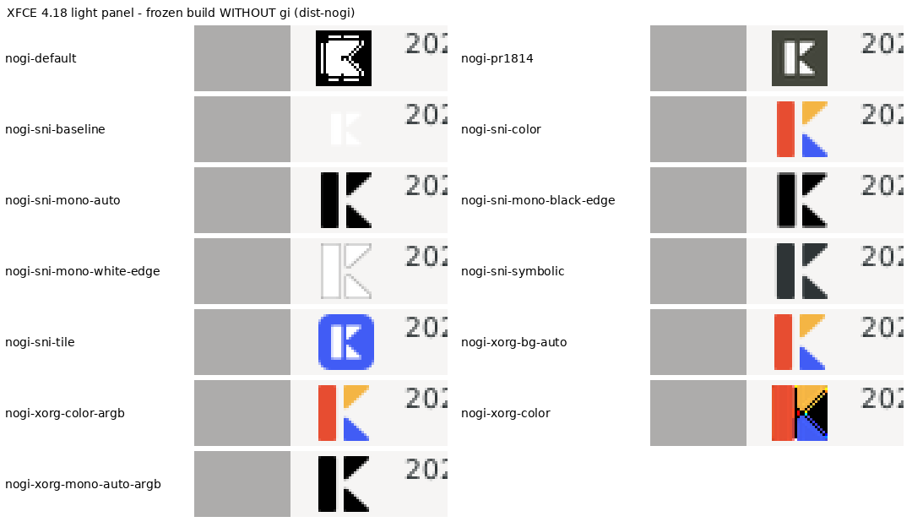 | 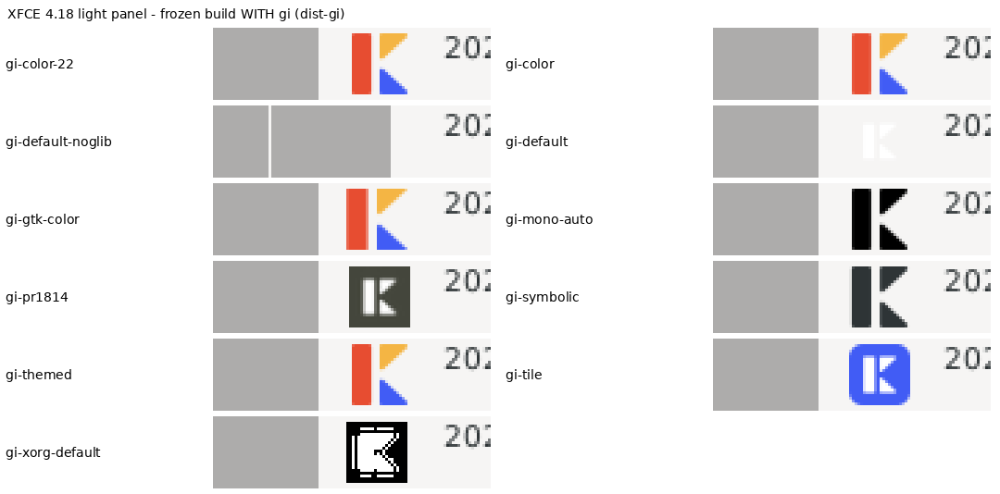 |
| XFCE dark | 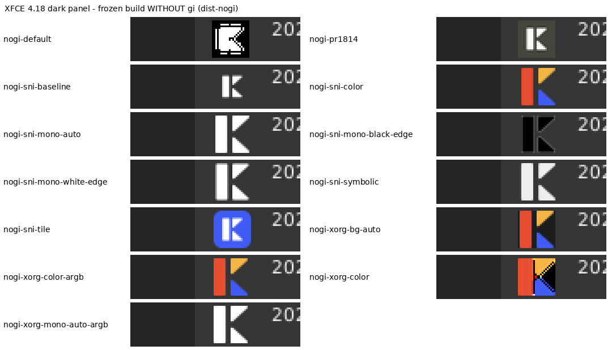 | 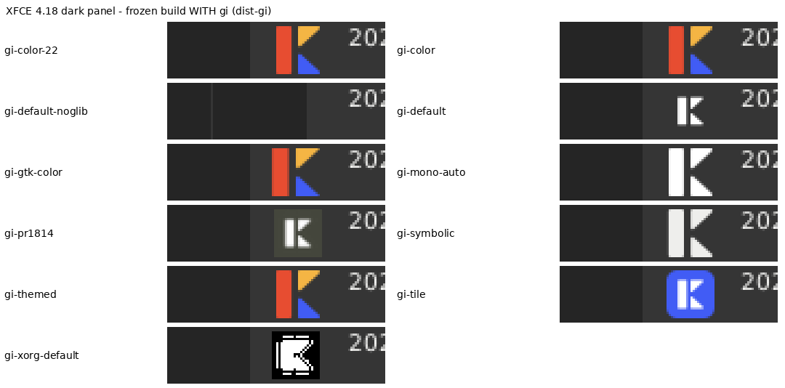 |

KDE Plasma 5.27 (unfrozen): 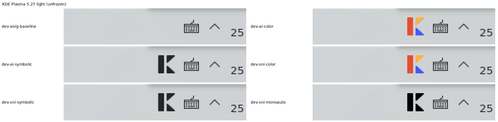 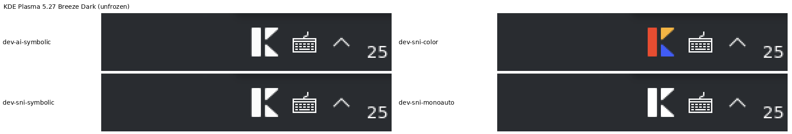

GNOME with the SNI tray and `symbolic` (full bar), and the SNI menu working (click → `Event(1, "clicked")` →
"Open Kiln Studio" handler ran):


`mono-auto` swapping live when XFCE switches to dark (before/after, no restart). The portal
`SettingChanged` fired, the heuristic re-read xfconf, and the log shows `swapping mono-black -> mono-white`:

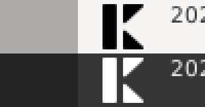

Dead ends: `--tray-xorg pseudo`, the white glyph on a light panel even with real alpha, and the SNI item on GNOME before
the registration fix:

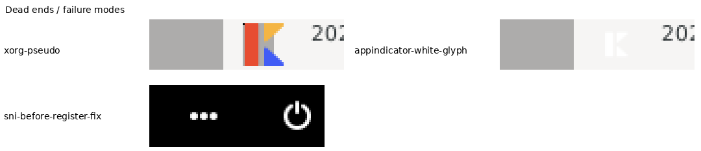

### mono-auto decisions (logged inputs → decision)

| desktop | inputs logged | decision |
|---|---|---|
| GNOME | `XDG_CURRENT_DESKTOP=GNOME`; portal Settings not available in VM → `gsettings` fallback | dark (GNOME rule) → white ✅ |
| XFCE light | portal `color-scheme=0`, gsettings `default`, xfconf `dark-mode=false`, theme `Adwaita` | light → black ✅ |
| XFCE dark | xfconf `dark-mode=true` | dark → white ✅ |
| KDE light / dark | gsettings `prefer-light` / `prefer-dark` (emulating what portal-kde reports) | ✅ / ✅ |

Notes: on XFCE the portal reported `color-scheme=0` even after switching to a dark theme, so I added XFCE's own
settings (`xfconf` `/panels/dark-mode`, `/Net/ThemeName`) as inputs. Cinnamon and Unity are covered by rules but untested.

## 4. Bundle size and startup cost of shipping gi/GTK

Same machine, same Python (GitHub Actions CPython 3.13, Tk 8.6), onefile:

| | `dist-nogi` | `dist-gi` | delta |
|---|---|---|---|
| onefile size | 327.4 MB | 379.1 MB | **+51.7 MB (+16%)** |
| extracted size (sum of PKG TOC) | 810.5 MB | 952.8 MB | +142.1 MB |
| files extracted per launch | 7,060 | 38,447 | **+31,387** |
| launch → first Python log line (2 runs) | 8.2 s, 6.1 s | 15.3 s, 10.2 s | **+4–7 s per launch** |

Where the +142 MB goes: 81 MB of shared libs (`libicudata.so.74` alone is 31 MB, `libgtk-3` 8 MB,
`librsvg` 7 MB, gnutls, cairo, …), 57 MB of `share/icons` (Adwaita, including 4 MB animated cursors), 2 MB of typelibs,
0.6 MB of themes. The SNI approach adds `jeepney` (~100 KB of pure Python) and nothing else.
(`lab/bundle_breakdown.py` produces this breakdown.)

Also: a bundled GTK 3 draws its menus with the **bundled** Adwaita theme, not the user's, and bundles its own
pixbuf loaders and ICU. That's the usual "PyInstaller + GTK looks foreign / breaks on a newer distro" risk,
and I didn't test it across distros.

## 5. Failures, surprises, workarounds

**PyInstaller + gi**
- PyInstaller's core `hook-gi*` files (not contrib) handle gi. `--hidden-import gi.repository.AyatanaAppIndicator3`
  plus `gi.repository.Gtk` is enough, and pystray's lazy imports are found anyway once PyGObject is in the venv.
  **Watch out:** installing PyGObject in the build venv silently changes the bundle even without the flags.
- PyGObject ≥ 3.52 moved to girepository-2.0. PyInstaller's gi hooks then need the
  **`GIRepository-3.0` typelib** (`gir1.2-girepository-3.0`) on the build machine. Without it, every
  `Failed to query GI module …` warning fires, typelibs and shared libs are **not collected**, and the build still
  "succeeds". The build machine also needs `libgirepository-2.0-dev libcairo2-dev pkg-config` to compile PyGObject.
- Ubuntu's legacy `gir1.2-appindicator3-0.1` installs its typelib in `/usr/lib/girepository-1.0/`, which
  girepository-2.0 doesn't search. Only **Ayatana** gets bundled, which is fine: pystray falls back to it.
- PyInstaller sets `GI_TYPELIB_PATH=$_MEIPASS/gi_typelibs` at runtime (logged). The bundled typelibs load the
  **bundled** `libayatana-appindicator3.so.1`, GTK 3 and friends, so the host's copies aren't used.

**Environment / build**
- `--splash` fails on the uv-managed CPython (python-build-standalone ships Tcl/Tk 9, `libtcl9tk9.0.so`):
  `Could not determine the path to Tcl and/or Tk shared library`. With the splash removed, the frozen app then
  crashes on `import tkinter` because the Tk 9 library isn't collected. CI avoids this by using
  `actions/setup-python` (Tk 8.6) with `--python-preference only-system`. I did the same, building on the
  GitHub Actions CPython tarball in a separate venv, and dropped `--splash` from the experiment build script only.
- GNOME Shell in a container: it needs a system bus and no `/run/systemd/seats`, so it falls back to its dummy login
  manager (`lab/gnome_start.sh`). Extensions enabled via gsettings after start-up don't load; restart the shell.
- SVG icons need the gdk-pixbuf SVG loader (`librsvg2-common`) **in the panel's process**. It is always present on
  real desktops, but my `--no-install-recommends` VM lacked it, and GNOME Shell caches loaders until restart.

**pystray**
- `xorg`: alpha dropped (the root cause), no menu, window at root depth.
- `appindicator`/`gtk` with `run_detached()`: needs a GLib loop, as above.
- `appindicator`/`gtk` call `org.freedesktop.Notifications.CloseNotification` during shutdown and raise if no
  notification daemon exists. That only happens at quit.
- The backend chooser only catches `ImportError`, as above.

**SNI prototype**
- GNOME's AppIndicator extension calls back into the item (`GetAll`) **before** replying to
  `RegisterStatusNotifierItem`. jeepney's blocking `send_and_get_reply` drops other incoming messages while it
  waits, so GNOME's call timed out and the extension showed its "…" placeholder. Registration is now fire-and-forget
  from the main loop. XFCE replies first and worked from the start.
- The extension also reads `Overlay*`/`Attention*`/`XAyatanaLabel*`. They are served as empty values.

**Things that didn't work**
- `--tray-xorg pseudo` (ParentRelative background, read it back, composite): both XFCE and GNOME composite the
  tray, so the read-back is black and the first `GetImage` raises `BadMatch`. It's a dead end on modern trays.
- `--tray-xorg argb` needs the tray to advertise a 32-bit `_NET_SYSTEM_TRAY_VISUAL`. XFCE does, and it's
  perfect there. GNOME's legacy tray advertises 24-bit, so it falls back to opaque.
- Forcing a light GNOME top bar for testing: neither the user-theme extension nor a test extension calling
  `Main.panel.set_style()` changed the rendered bar in Xvfb (the theme node reported the new color).
  GNOME's bar is dark by design, so GNOME was only tested dark.

## 6. What I could not verify in the VM (needs real hardware)

- **Wayland sessions.** Everything here is X11 under Xvfb. Expected, but unverified:
  SNI works natively on GNOME-Wayland (with the extension) and KDE-Wayland, XEmbed/xorg shows nothing,
  and pystray `gtk` (GtkStatusIcon) shows nothing.
- **HiDPI / fractional scaling.** I didn't test scale 2. SNI sends up to 64px and `symbolic` is vector, so both should
  be fine; the xorg paths paint at the slot size.
- **KDE with the frozen build** and **Plasma 6**. KDE was tested unfrozen on Plasma 5.27 only. XEmbed icons didn't appear
  through `xembedsniproxy` in the VM, so I have no KDE result for production's xorg path.
- **GNOME light top bar.** GNOME's bar is dark by design and I couldn't restyle it in Xvfb. A GNOME user running
  a light-panel extension (e.g. Dash to Panel) is untested; `symbolic` would handle it.
- **Cinnamon, MATE, Budgie, Unity, i3/sway + waybar.** The heuristics exist but are untested. All of these implement SNI.
- **Real xdg-desktop-portal on GNOME.** The portal's Settings interface wasn't available in the systemd-less VM, so GNOME
  took the `gsettings` fallback. The portal path itself was exercised on XFCE, including a live `SettingChanged`.
- **ubuntu-22.04 CI builder.** CI builds on 22.04. I built on 24.04 with the 24.04 build of the same Actions CPython.
  The gi build bundles the builder's GTK and ICU, so building on 22.04 changes exactly which libraries ship.
- **Clicking through menus on XFCE/KDE**, and the Activate (left-click) behaviour on each host. I only drove the menu
  on GNOME.
- **Stock Fedora GNOME** (no AppIndicator extension): no tray is expected with any approach.

## 7. Recommendation

**Ship a small pure-Python StatusNotifierItem tray on Linux (`tray_sni.py` design), using the
vector-rendered `color` icon as multi-size `IconPixmap`s.** Keep `symbolic` in mind as an option if
you want monochrome to match the panel (details below).

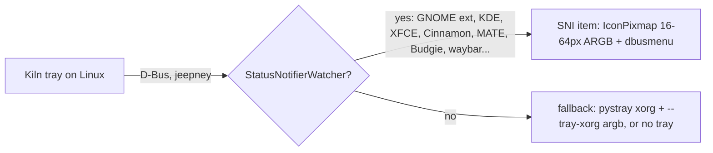

Why:

- **Fixes both problems at the source.** SNI pixmaps are ARGB32, so the host composites real
  alpha. We send 16/22/24/32/48/64, so the host picks the right size and never has to resize.
- **No GTK in the bundle.** It adds one ~100 KB pure-Python dependency, versus +52 MB onefile / +142 MB
  unpacked / +31k files for gi. It avoids the whole PyInstaller-gi class of problems: the GIRepository-3.0
  typelib on the builder, bundled GTK clashing with host themes, IM modules and pixbuf loaders, and ICU.
- **Works where it matters.** Verified in this VM on GNOME 46 (Ubuntu AppIndicator extension), XFCE 4.18
  and KDE Plasma 5.27, on dark and light panels, including a working menu (Open/Quit) on GNOME. SNI is also
  the only protocol that works natively on Wayland; XEmbed is X11-only.
- **Fixes a behavior bug for free.** Today's xorg backend has no menu, so Quit is unreachable from the Linux tray.
- **Doesn't need the GLib thread**, doesn't touch the notification daemon, and doesn't depend on pystray internals.

Tradeoffs and risks:

- It's our own ~350 lines of D-Bus protocol code instead of a library. SNI and dbusmenu are stable
  specs, but host quirks exist. I hit one (GNOME calls back before replying to Register), and there
  will be others (see §6 for what's unverified). The mitigation is a small test suite against
  `dbus-daemon --session` plus the lab scripts.
- **Stock GNOME without the AppIndicator extension has no tray at all**, with any approach. Ubuntu, Pop!_OS and
  Zorin ship the extension; Fedora Workstation and vanilla GNOME don't. Same as today.
- `jeepney` becomes a Linux dependency. It's already common: it's pulled in by `secretstorage`/`keyring`.

**Which icon:**

- `color` (recommended default). It matches macOS/Windows brand presence, is legible on light and dark
  panels, and needs no detection. The weak spot is the blue triangle on mid-blue panels (contact sheet).
- `symbolic` (+ `mono-auto` pixmap fallback) if you want it to look native. It's recolored by the panel on
  GNOME, XFCE and KDE (verified) and follows theme changes live for free. It costs brand color, and the SVG
  must be on disk (it's bundled, so fine).
- `tile` is the most robust on any background, but it looks heavier than neighbouring icons.
- Avoid `mono-auto` alone: the heuristic is right on the desktops tested but is guesswork elsewhere.
  `symbolic` gets the same result from the host.

**If you'd rather not own D-Bus code:** bundle gi and keep pystray `appindicator`. It requires *all* of:
the GLib main-loop thread, replacing pystray's notifier, a guard for pystray's `ValueError` crash
on hosts without the typelib, the build-machine packages, and +52 MB. Use `symbolic` via the
`ThemedTray` subclass, or `color`.

**Cheapest improvement if you change nothing structural:** keep the xorg backend but add
`--tray-xorg argb` (a 32-bit window from `_NET_SYSTEM_TRAY_VISUAL`) and the `color` asset. That's real alpha
on XFCE/MATE/Cinnamon-style XEmbed trays, but still opaque on GNOME's legacy tray (24-bit visual),
still no menu, and no Wayland.

**Also fix regardless:** Linux currently ships the macOS *template* glyph (`mac_taskbar.png`, pure
white). Whatever mechanism wins, ship Linux its own asset.

## 8. Reproduce / run

```bash
uv run python scripts/gen_tray_icons.py                  # assets + contact sheet
app/desktop/build_tray_experiments.sh --no-gi            # dist-nogi (production-like)
app/desktop/build_tray_experiments.sh --gi               # dist-gi (needs gir1.2-girepository-3.0, libgirepository-2.0-dev, libcairo2-dev)
./Kiln --tray-backend sni --tray-variant symbolic        # any combination; log in /tmp/kiln-tray-experiments.log
```

`--tray-variant baseline|pr1814|color|tile|mono-white|mono-black|mono-white-edge|mono-black-edge|mono-auto|symbolic|themed`,
`--tray-backend appindicator|gtk|xorg|sni`, `--tray-xorg stock|argb|pseudo|bg:#rrggbb|bg:auto`,
`--tray-size N`, `--tray-glib-thread on|off`, `--tray-exit-after SEC`.

Headless lab (Ubuntu 24.04): `docs/tray-experiments/lab/` has `gnome_start.sh`, `start_xfce.sh`, `start_kde.sh`,
`run_variant.sh` (launch → wait for tray → screenshot → crop), `run_matrix.sh <gnome|xfce> <label>`, `make_grid.py`,
`bundle_breakdown.py`, `mini_tray.py`.

Code map (throwaway, to be rewritten): `app/desktop/tray_experiments.py` (flags, diagnostics, variants,
pystray subclasses, mono-auto), `app/desktop/tray_sni.py` (SNI + dbusmenu over jeepney),
`app/desktop/desktop.py` (hooks), `scripts/gen_tray_icons.py`, `app/desktop/tray_icons/`.

